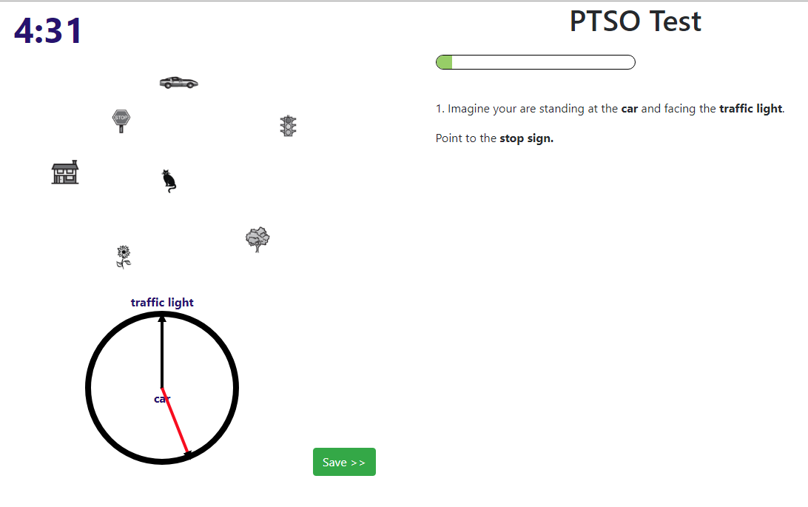

# Perspective Taking/Spatial Orientation Test - PHP Implementation
Web-based electronic version of the "Perspective Taking/Spatial Orientation Test" by Hegarty, Kozhevnikov and Waller. It avoids
the need for measuring the participants' response angles by hand and for computing the delta angle to the correct solution. 
This is a port of the [original Python version by Tim Domino](https://github.com/TimDomino/ptsot) so the test can more easily be administered through a Web page.

## Background
The test is based on two main papers:
 * Hegarty, M., & Waller, D. (2004). A dissociation between mental rotation and perspective-taking spatial abilities. Intelligence, 32, 175-191.

 * Kozhevnikov, M., & Hegarty, M. (2001). A dissociation between object-manipulation and perspective-taking spatial abilities. Memory & Cognition, 29, 745-756.
 
## Dependencies
 * PHP (`sudo apt-get install PHP7.0` on Debian-based systems). Should also work with earlier and later versions of PHP, although not tested.
 * The program loads jQuery and Bootstrap automatically.
  
## Instructions
* The test can be put on a Web server with a default page of `index.php`. The logic is contained in `index.js`.

* The files `count.dat` and `responses.dat` must be writable by the Web server

* This version assigns a participant number instead of asking for one. The number is stored and incremented in the `count.dat` file.

* You can customize the text by changing the following files:
     - `tasks.json` - Test questions and answers
     - `instructions.html` - Test instructions
     -  `example.html` - Example question explanation
     -  `question.html` - Display of each question with placeholders for variables.

The `object_array.png` file is the grid of items, not modified from its original version.

For output, the program posts to itself (`save.php`) and adds a line of encoded/stringified JSON to an output file, `responses.dat` with:
 * Participant number.
 * Angle in degrees drawn for each question.
 * Average absolute deviation from correct angle in degrees across all questions.
 * Date and time submitted.
 * Whether it was complete (incomplete = time expired).

## Screenshot

 
